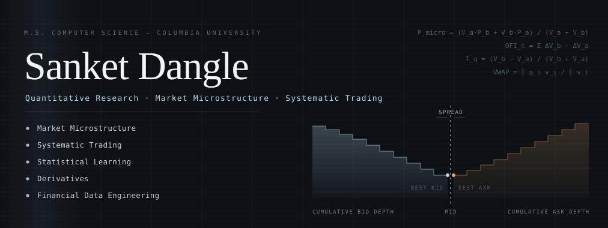
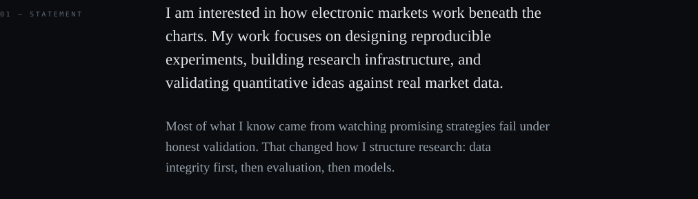
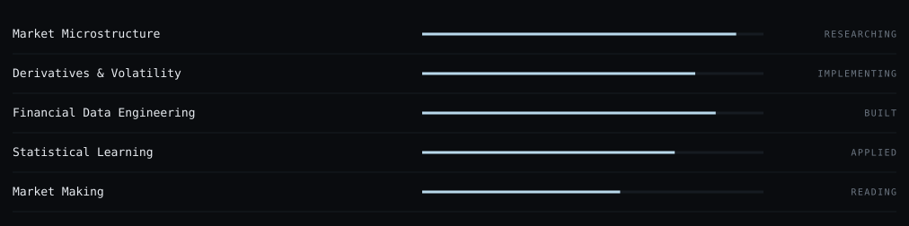
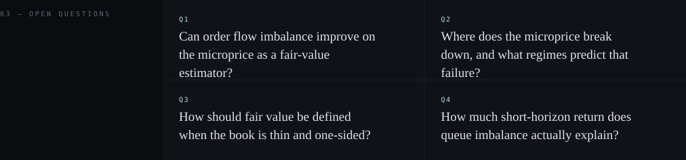
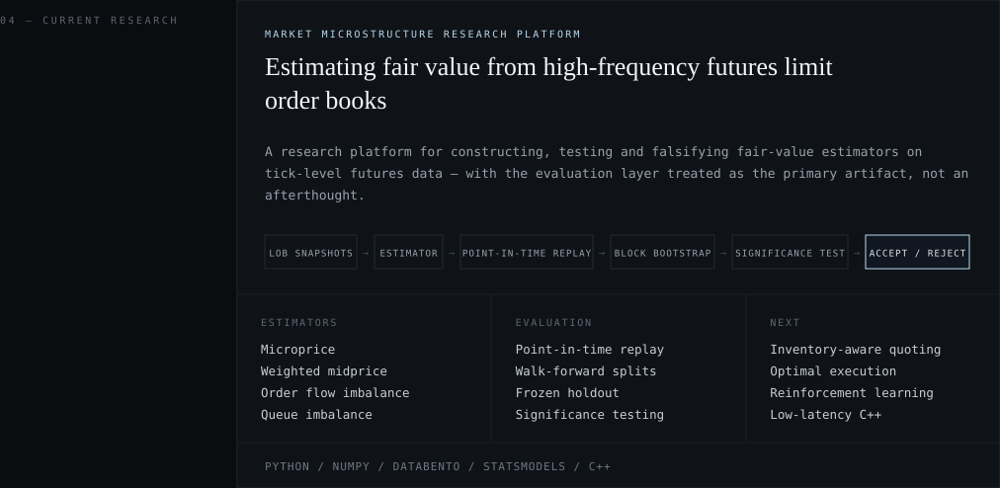
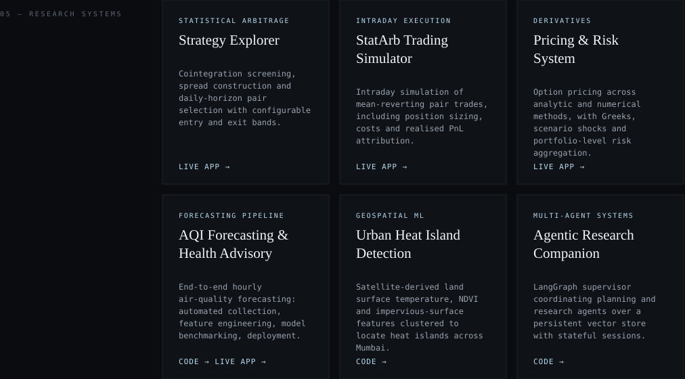
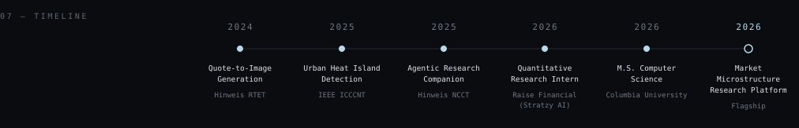
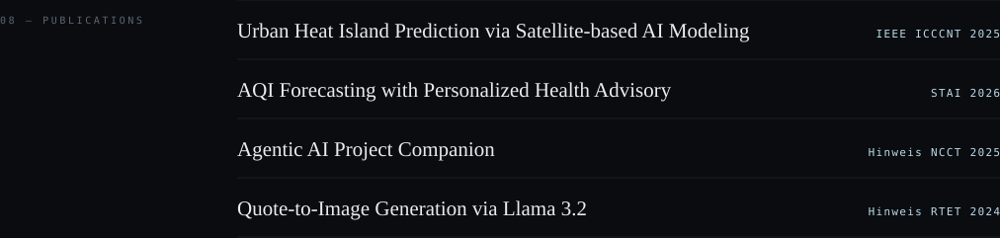
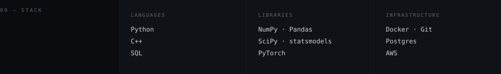
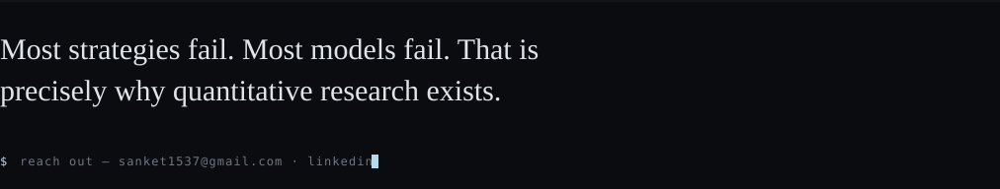

<b>Links</b> · 
<a href="https://statarbstrategyexplorer.streamlit.app/">StatArb Strategy Explorer</a> · 
<a href="https://intradaystatarbtradingsimulator.streamlit.app/">Intraday StatArb Simulator</a> · 
<a href="https://huggingface.co/spaces/shanks1911/derivatives-pricer">Derivatives Pricer</a> · 
<a href="https://github.com/shanks1911/AQI_Health_Advisory">AQI code</a> · 
<a href="https://aqihealthadvisory.streamlit.app/">AQI app</a> · 
<a href="https://github.com/shanks1911/UHI">Urban Heat Island code</a> · 
<a href="https://github.com/shanks1911/Agentic_AI_Project_Companion">Agentic Companion code</a>

<a href="mailto:sanket1537@gmail.com">sanket1537@gmail.com</a> · <a href="https://www.linkedin.com/in/sanketdangle/">LinkedIn</a>
